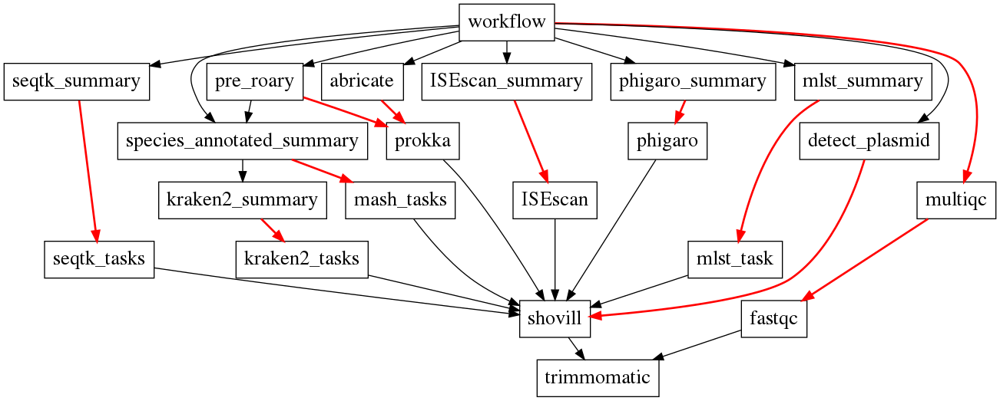

# Pangenome analysis workflow

The project is a pipleine intergrating different tasks for pangenome analysis.

Dependency Graph of this workflow.



Red arrow represent the step is combining multiple results generated from the upper step.

## Installation

This is a project composed with a lot of other tools or software. Some software also contain its own database.

There is no way could easily handle all these software at one-click.
Here we provide a `environment.yml` for easy create a environment with **ananconda**. It might encount different problems since the diversity of the software.

Here is a list of the necessary software

* [trimmomatic](http://www.usadellab.org/cms/index.php?page=trimmomatic)
* [fastqc](https://github.com/s-andrews/FastQC)
* [multiqc](https://github.com/ewels/MultiQC)
* [shovill](https://github.com/tseemann/shovill)
* [prokka](https://github.com/tseemann/prokka#installation)
* [fasttree](http://www.microbesonline.org/fasttree/)
* [ISEscan](https://github.com/444thLiao/ISEScan/tree/test)
* [abricate](https://github.com/tseemann/abricate)
* [Spades](http://cab.spbu.ru/software/spades/)
* [mlst](https://github.com/tseemann/mlst)
* [kraken2](https://github.com/DerrickWood/kraken2)
* [seqtk](https://github.com/lh3/seqtk)
* [phigaro](https://github.com/444thLiao/phigaro)

> Especially need to be noticed, phigaro should install the forked version mentioned above. Or it will **hang up** to waiting for your input instead of run it thought. This is a defect of it original version. (May be solved in current version?)

The software that published in conda mirror had been added to `environmen.yml`.

`conda env create -f environment.yml`

But **ISEscan**, **quast** abd **phigaro** need user to installed yourself and its dependency. And database of **abricate** and **kraken2** also need to downlaod.

## config

After installing all these stuff, you must fulfill a `config` file which located at `pipelines/soft_db_path.py`.

## testing

```bash
python3 pipelines/main.py testdata -o output_dir
```

It is important to note that the `luigi` used as workflow management in our pipeline require a scheduler. If you doesn't run a deamon to listen the works, you should add a extra parameter `--local-scheduler`

## QuickStart

After you install the pipelines correctly, you could start using the pipelines for your own data.

Following the rules of `toolkit/data_input.template`, fulfill a new `data_input.tab`.

With this tab, you could run:

```bash
python3 pipelines/main.py run -- workflow --tab data_input.tab --odir output_dir --workers 2 --log-path output_dir/cmd_log.txt
```

Don't forget the **double dashes** after the `run` since it is necessary for the library `click` to accept parameters.

Besides the params `--tab`, `--odir`, `--analysis-type`, `--log-path`, other params are luigi implemented.

Here describe a little bit about these params. For more detailed, you should check the documentation of luigi at [luigi doc](https://luigi.readthedocs.io/en/stable/)

* `--tab`: given a path(could be relative/absolute) of `input_data.tab`
* `--odir`: jus the path of output directory.
* `--log-path`: it will record the cmd history.*(optional)*
* `--workers`: it could control how many tasks could be parallel.
* `--thread`: it could control how many thread could be used at each task.

## preset scheme

For most people, some modules were redunctant. So I implement a preset param that allow the user only use a set of modules.
For now, it only contain following schemes.

1. full
2. wgs
3. qc
4. plasmid


You could use it by passing the param like `--preset wgs` following the original command. Or if you want to have multiple scheme in a single run, you could use `--preset wgs+qc` to run both `wgs` and `qc` in a single run.
The default scheme is wgs (it only perform assembly and prokka annotation, and it will stop.)

```bash
python3 pipelines/main.py run -- workflow --tab data_input.tab --odir output_dir --workers 2 --log-path output_dir/cmd_log.txt --preset wgs --local-scheduler
```

## about the `data_input.tab`

Please following the template file `toolkit/data_input.template`, new **data_input.tab** should contains all its header.

`\t` is taken as separator of this `data_input.tab` for better handle some weird filename.

Inside this `data_input.tab`, you could append more columns besides the necessary `five columns(sample ID	R1	R2  ref gff)`. This pipelines only check you have these three instead of only have these five.

Besides that, if you don't know which `ref` or which `gff` you need to choose, you could just left blank and it will pass `quast` step.

These columns only used to perform quality assessment for now.

## about post analysis

For convenient visualization and assessment for the output of pipelines, a script called `toolkit/post_analysis.py` was implemented. Because it need to use the pan-genome analysis output, the output directory of **roary** is necessary.

```bash
python3 toolkit/post_analysis.py run -r output_dir/all_roary_o -o output_dir/new_summary_output_dir
```

> * output_dir is the directory you indicate when running the `main.py`
> * `-o` is the directory where you want to stodge the output files

for advanced user, you could also use `-p` & `-a` to indicate the path of prokka or the path of abricate_file. Normally, `abricate_file` will recalculated with the abricate ouput directory at  **output_dir** otherwise you could simple use the file located at `output_dir/abricate_result/samples2annotate.csv`

## Q&A

Although I have try real data for test, but different kinds of input is unpredictable. Here provide some of the problems may occurs and its solution.

1. Why my workflow stop and hang up such a lot time and doesn't consume any CPU resource?
   > I think it is the problem I mention it above. Inside the original version of phigaro, it will ask the user to input yes or no to continue. If you using the original version of phigaro, please change it to forked version of mine. https://github.com/444thLiao/phigaro . If you want to know what i have change, you could see the file under the phigaro project (`phigaro/batch/task/preprocess.py`)
   >
2. How could I change the parameter of one of the task?
   > For now, it may be difficult to change it easily. You may need to go inside the project and find the file `pipelines/constant_str.py`. You could change the command line template for meet you requirement, but you need to be careful these `{}` and not to change them.
   >
3. Could I add more tasks?
   > Yes, of course you could manually reconstruct and add/delete more tasks. But first you should look carefully at `pipelines/pangenome_pipelines.py`. All sub tasks of luigi were put here, you should process the dependency of them.
   >

## Feedback

Please file questions, bugs or ideas
to the [Issue Tracker](https://github.com/444thLiao/pangenome_workflow)

## Authors

Tianhua Liao
email: l0404th@gmail.com
